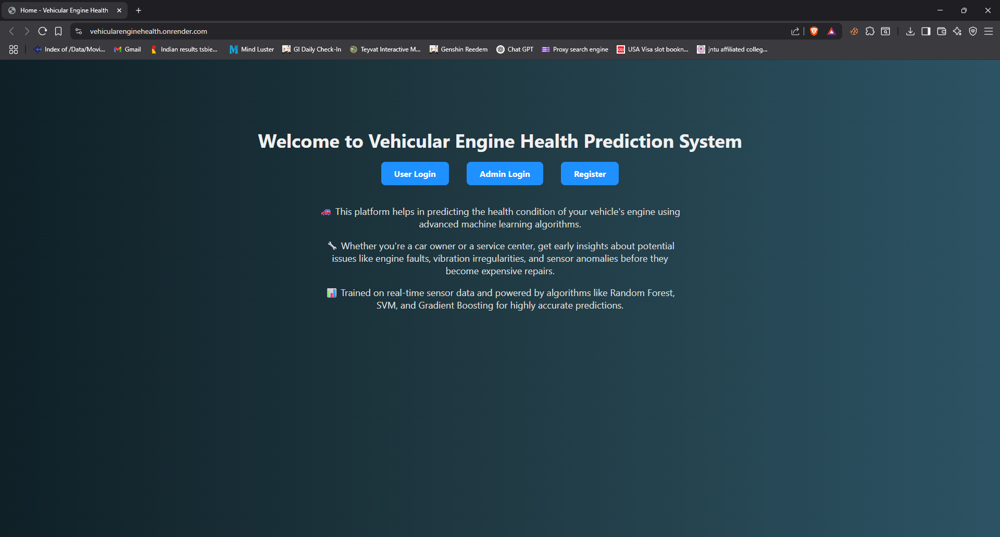
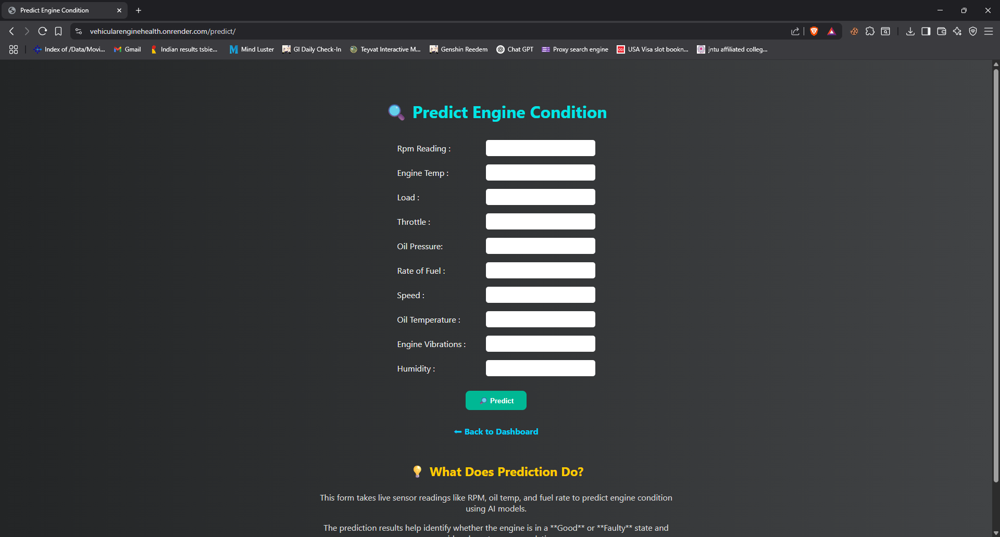
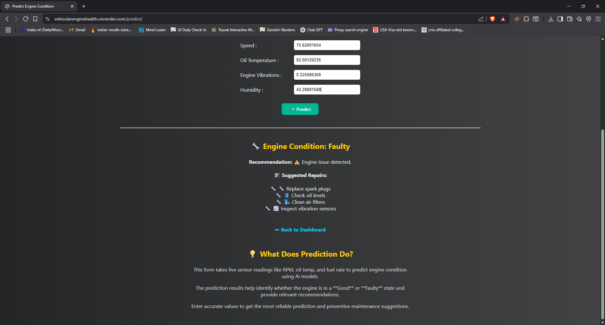

# 🚗 Vehicular Engine Health Prediction using Machine Learning

This project is a full-stack **Machine Learning web application** built using **Django** that allows users to input vehicular parameters and receive real-time predictions about engine health. The goal is to help diagnose potential engine issues early using predictive analytics.

---

## 🔍 Project Overview

- **Frontend**: HTML, CSS (via Django templates)
- **Backend**: Django 2.1.7
- **ML Model**: Trained using TensorFlow 2.4.1 / Keras
- **Database**: MySQL (development) / SQLite (deployment)
- **Deployment**: Render.com (or any other platform)

---

## 🧠 Features

- Upload or enter engine parameter data
- Process the input through a trained ML model in the background
- Display results predicting engine health condition
- Minimalist and user-friendly web interface
- Easily deployable on cloud platforms like Render

---

## 💻 Installation (Local Setup)

### 1. Clone the repository
```bash
git clone https://github.com/Harsha131104/VehicularEngineHealth
cd VehicularEngineHealth
```

### 2. Create a virtual environment
```bash
python -m venv venv
source venv/bin/activate   # On Windows: venv\Scripts\activate
```

### 3. Install dependencies
```bash
pip install -r requirements.txt
```

### 4. Set up the database
- Use SQLite (default for deployment):
```bash
python manage.py migrate
```

### 5. Run the development server
```bash
python manage.py runserver
```

Then visit: `http://127.0.0.1:8000/`

---

## 🚀 Deployment (Render)

This project is deployable on [Render](https://render.com/):

### Files needed:
- `requirements.txt`
- `build.sh`
- `Procfile`

### Sample `Procfile`
```
web: gunicorn VehicularEngineHealth.wsgi
```

### Sample `build.sh`
```bash
#!/usr/bin/env bash
pip install -r requirements.txt
python manage.py collectstatic --no-input
python manage.py migrate
```

Set environment variables on Render:
- `SECRET_KEY` - Generate random key from render
- `DJANGO_SETTINGS_MODULE` - VehicularEngineHealth.settings
- `PYTHON_VERSION` - 3.8.0
- (Optional) `DEBUG=False` - in VehicularEngineHealth\settings.py

---

## 🧾 Example Input

| Parameter           | Description                 |
|---------------------|-----------------------------|
| Engine RPM          | Revolutions per minute      |
| Oil Temperature     | Temperature in Celsius      |
| Oil Pressure        | Pressure in PSI             |
| Throttle Position   | % of full throttle          |

---

## ✅ Output

Returns a classification such as:
- `"Engine Condition: Good"`
- `"Engine Condition: Faulty"`
- `Suggested Repairs:`

---

## 🛠️ Technologies Used

- Python 3.8
- Django 2.1.7
- TensorFlow / Keras
- MySQL / SQLite
- HTML5, CSS3

---

## 📂 Folder Structure

```
VehicularEngineHealth/
│
├── engineapp/                # Django app for ML integration
├── models/                    # Pretrained ML models (.pkl)
├── dataset/                  # Sample or training datasets (CSV, etc.)
├── database/                 # Local DB backups or schema files
├── screenshots/              # Images for README/demo
├── .gitignore                # Git ignored files
├── manage.py                 # Django project runner
├── requirements.txt
├── Procfile
├── build.sh
├── README.md
├── VehicularEngineHealth/   # Django project settings
    ├── templates/                # HTML Templates

```

---

## 📸 Screenshots






---

## 🧑‍💻 Author

**Harsha Gattu**  
[GitHub Profile](https://github.com/Harsha131104)

---